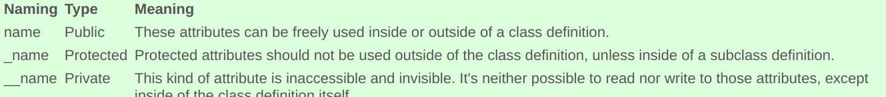

[oop](https://www.python-course.eu/python3_object_oriented_programming.php)

class A:
  pass

class A(): 

  pass

The latter is a syntax error on older versions of Python. In Python 2.x you should derive from object whenever possible though, since several useful features are only available with new-style classes (deriving from object is optional in Python 3.x, since new-style classes are the default there).

------

**attributes naming in python** 

